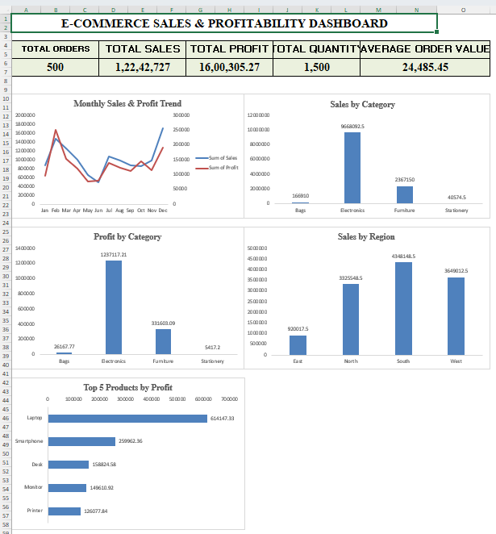

# E-Commerce Sales & Profitability Analysis

## 📌 Project Overview

This project analyzes e-commerce sales and profitability data using Microsoft Excel.

The objective was to clean and analyze the data, identify important sales and profitability trends, and present the findings through an interactive and visually clear Excel dashboard.

## 🛠️ Tools & Techniques

- Microsoft Excel
- Data Cleaning
- PivotTables
- PivotCharts
- KPI Analysis
- Data Analysis
- Dashboard Creation

## 📊 Key KPIs

| KPI | Value |
|---|---:|
| Total Orders | 500 |
| Total Sales | 12,242,727 |
| Total Profit | 1,600,305.27 |
| Total Quantity | 1,500 |
| Average Order Value | 24,485.45 |

## 📈 Analysis Performed

The project analyzes:

- Monthly Sales & Profit Trends
- Sales by Category
- Profit by Category
- Sales by Region
- Top 5 Products by Profit
- Payment Mode Performance
- Discount Level Analysis

## 💡 Key Business Insights

- Electronics generated the highest sales and profit among all categories.
- South region recorded the highest sales.
- Laptop generated the highest profit among the analyzed products.
- December recorded the highest monthly sales.
- Credit Card was the highest-sales payment mode.
- Profit varied across different discount levels.

## 📷 Dashboard Preview

## 📂 Project Files

- `Ecommerce_Sales_Profitability_Analysis.xlsx` — Complete Excel analysis and dashboard
- `Dashboard.png` — Dashboard preview

## 🎯 Project Objective

To analyze e-commerce sales and profitability, identify key performance trends, and present actionable business insights through an Excel dashboard.
